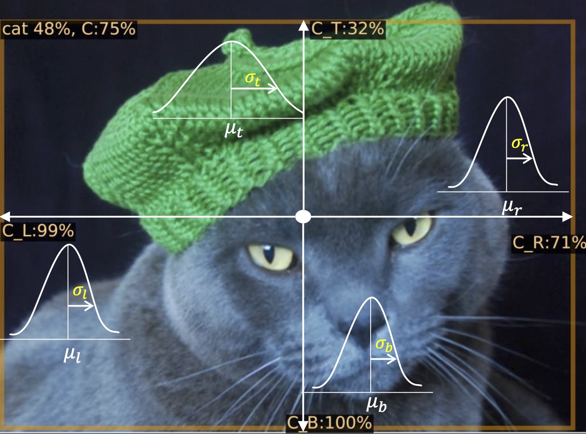
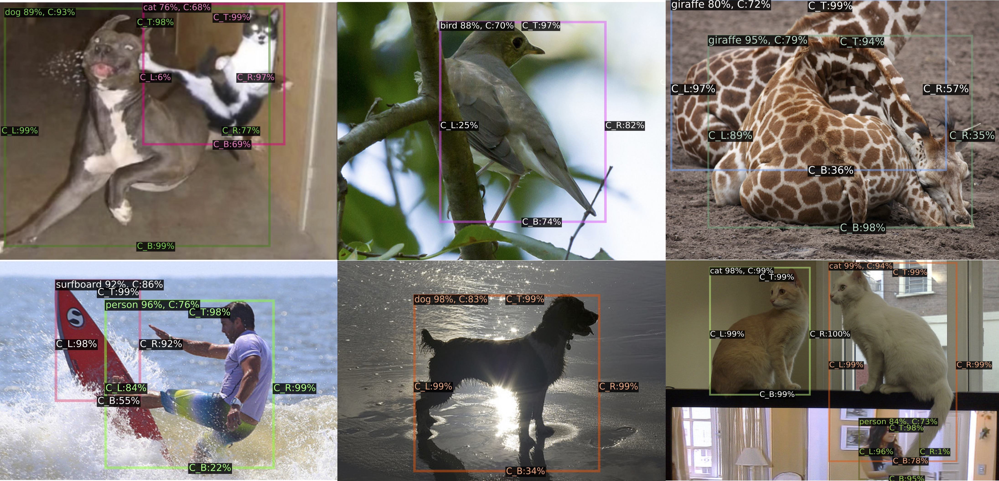

# [UAD](https://arxiv.org/pdf/2006.15607.pdf): Localization Uncertainty Estimation for Anchor-Free Object Detection

This repository inlcudes official implementations and model weights for [UAD](https://arxiv.org/pdf/2006.15607.pdf).  
[[`Arxiv`](https://arxiv.org/abs/2210.02077)][[`BibTeX`](#CitingUAD)]
 

  
C_L, C_R, C_T, and C_B denote the estimated certainty in [0, 1] value with respect to left, right, top, and bottom. For example, the proposed UAD
estimates low top-directional certainty due to its ambiguous head boundary of the cat wearing a hat. This demonstrates that our method enables the detection network to quantify which direction is uncertain due to unclear or obvious objects.

  
Estimated uncertainty examples of the proposed UAD. Since there is no supervision of uncertainty, we analyze the estimated uncertainty qualitatively. UAD estimates lower certainties on unclear and ambiguous boundaries due to occlusion and shadow. For example, Both the surfboard and the person in the left-bottom image have much lower bottom-directional certainties (i.e., C_B : 55% and 22%) as their shapes are quite unclear due to the water. Also, the right-directional certainty (C_R) of the woman in the right-bottom image is estimated only by 1% because it is covered by the tail of a cat on the TV.


## Models

Name | box AP (val) | box AP (test-dev) | download
--- |:---:|:---:|:---:
[UAD_R_50_ms_2x](configs/uad/uad_r_50_ms_2x.yaml) | 42.2 | 42.4 | [model](https://www.dropbox.com/scl/fi/jy28akq12z61sj94lie8z/uadet_r_50_ms_2x_42_23.pth?rlkey=j5s80y32z2qad6uoaq59cb2rb&dl=0)
[UAD_R_101_ms_2x](configs/uad/uad_r_101_ms_2x.yaml) | 44.0 | 44.2 | [model](https://www.dropbox.com/scl/fi/pwklc9f76qq3dehl7wxka/uadet_r_101_ms_2x_44_00.pth?rlkey=hohruu798fcz1p76ozrxols2k&dl=0)
[UAD_X_101_64x4d_ms_2x](configs/uad/uad_x_101_64x4d_ms_2x.yaml) | 45.2 | 45.4 | [model](https://www.dropbox.com/scl/fi/gf69r15u2bwfcku0cvnv0/uadet_x_101_64x4d_ms_2x.pth?rlkey=owcth36pf50wkclvh1uwj7fu4&dl=0)
[UAD_X_101_32x8d_dcnv2_ms_2x](configs/uad/uad_x_101_32x8d_dcn_ms_2x.yaml) | 48.0 | 48.4 | [model](https://www.dropbox.com/scl/fi/k436lfv0gvtkeh0qnx8uo/uadet_x_101_32x8d_dcn_ms_2x.pth?rlkey=ogn5r9zneng11c4uob69d4buo&dl=0)


## Installation

First install Detectron2 following the official guide: [INSTALL.md](https://github.com/facebookresearch/detectron2/blob/master/INSTALL.md). Then build UAD with:
```
git clone https://github.com/youngwanLEE/UAD.git
cd UAD
python setup.py build develop
```


## How to demo


1. Pick a model and its config file, for example, `uad_r_50_ms_2x.yaml`.
2. Download the pretrained model using the above download link.
3. Run the demo with

```
python demo/demo.py \
    --config-file configs/uad/uad_r_50_ms_2x.yaml \
    --input test_images/000000580743.jpg \
    --output ./ \
    --opts MODEL.WEIGHTS uadet_r_50_ms_2x_42_23.pth
```  

`--config-file`: config file for model  
`--input`: input images/videos path  
`--output`: output directory to save the output  
`--opts MODEL.WEIGHT`: the pretrained weight path  


## How to train on COCO

We train UAD models using a machine equipped with 8 GPUs.If you want to change the number of GPUs, use `--num-gpus` argument.  
[Detectron2's document](https://detectron2.readthedocs.io/en/latest/tutorials/getting_started.html) may help you for more details.


```
python tools/train_net.py \
    --config-file configs/uad/uad_r_50_ms_2x.yaml \
    --num-gpus 8 \
    OUTPUT_DIR training_dir/uad_r_50_ms_2x
```


To evaluate the model after training, run:

```
python tools/train_net.py \
    --config-file configs/uad/uad_r_50_ms_2x.yaml \
    --eval-only \
    --num-gpus 8 \
    OUTPUT_DIR training_dir/uad_r_50_ms_2x \
    MODEL.WEIGHTS training_dir/uad_r_50_ms_2x/model_final.pth
```


## License
This project is under CC-BY-NC 4.0 license. Please see [LICENSE](LICENSE) for details.


## Acknowledgement
This implementation are based on [Detectron2](https://github.com/facebookresearch/detectron2) library.  
This work was supported by Institute of Information & Communications Technology Planning & Evaluation(IITP) grant funded by the Korea government(MSIT) (No.2014-3-00123, Development of High Performance Visual BigData Discovery Platform for Large-Scale Realtime Data Analysis, No.2022-0-00124, Development of Artificial Intelligence Technology for Self-Improving Competency-Aware Learning Capabilities).

## <a name="CitingUAD"></a>Citing UAD

```BibTeX
@inproceedings{lee2022uad,
      title={Localization Uncertainty Estimation for Anchor-Free Object Detection}, 
      author={Youngwan Lee and Jong-Won Hwang and Hyung-Il Kim and Kimin Yun and Yongjin Kown and Sung Ju Hwang},
      booktitle={ECCV-Workshop}
      year={2022},
}
```